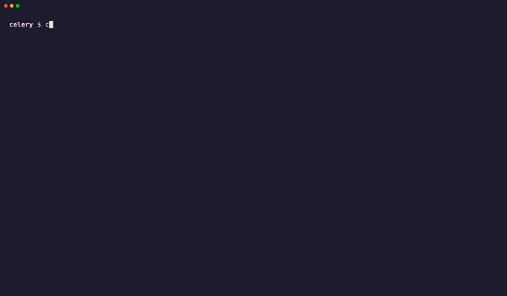
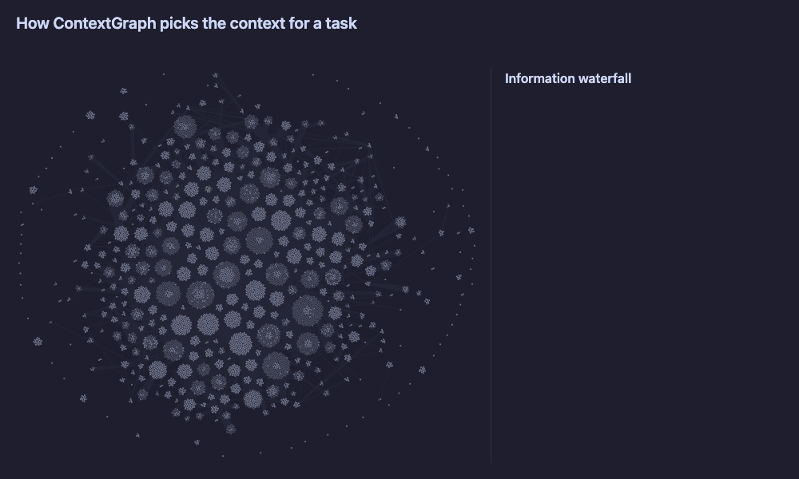
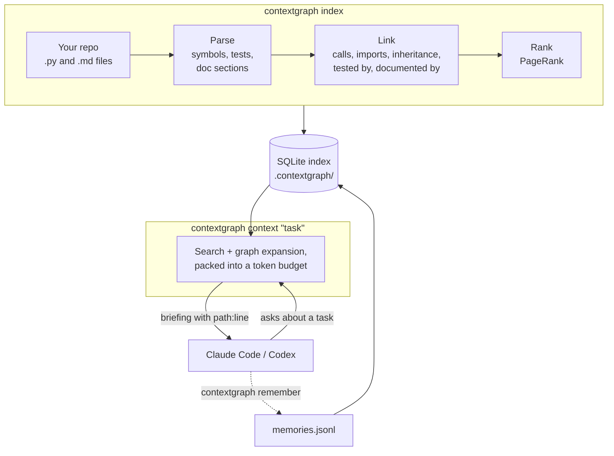

# ContextGraph

**Give your coding agent the code that matters for a task, not the whole repo.**




ContextGraph turns your repository into a graph of its code (functions, classes, calls, imports, tests and docs) and keeps notes that your agent saves between sessions. When the agent starts a task, one command gives it a short briefing: the relevant code, how it connects, the tests that cover it, and what earlier sessions learned. Every item has a `path:line` pointer, and the whole briefing fits a token budget you choose.

It is a command-line tool plus a skill file for Claude Code and Codex. It runs on your machine and needs no server, database or API key.

[Quickstart](#quickstart) · [What the agent sees](#what-the-agent-sees) · [How it works](#how-it-works) · [Commands](#commands) · [FAQ](#faq)

## Why ContextGraph?

Without it, a coding agent learns your repo the slow way. It greps, opens whole files, follows imports by hand, and forgets it all when the session ends. Most of the tokens go into finding the code, not into working with it.

ContextGraph does that finding up front, once, and keeps the result up to date:

- **The right code in one call.** `contextgraph context "<task>"` returns the relevant symbols, their callers and callees, source excerpts, tests and docs.
- **A token budget.** You choose the size (default 5000 tokens). Anything that didn't fit is listed as `path:line` pointers, so the agent can still read it.
- **Memory across sessions.** The agent saves what it discovered, linked to the code. If that code changes later, the note is flagged as possibly outdated.
- **Incremental updates.** Re-indexing only re-parses the files that changed.

In a test on [celery](https://github.com/celery/celery) (110k lines of Python), Claude Code answered an architecture question with 61% fewer input tokens and 38% lower cost when it used ContextGraph. That was a single run, so treat it as a hint, not a guarantee.

### Compared to other approaches

| Approach | Good at | Weak at |
|---|---|---|
| `grep` / opening files | Exact string lookups, always up to date | Doesn't show structure. The agent pays tokens to rebuild it every session. |
| RAG over code chunks | Finding code from a natural-language question | Chunks cut through functions. Doesn't follow calls or find the tests. |
| **ContextGraph** | Whole symbols with their callers, tests and docs, within a budget, plus memory | Needs an index step. Python and Markdown only. Call links are best-effort. |

ContextGraph doesn't replace grep. The skill tells the agent to fall back to it when the results don't help.

## Quickstart

Requires Python 3.12+.

**1. Install**

```bash
uv tool install "contextgraph[embed] @ git+https://github.com/Kakoedlinnoeslovo/contextgraph"
# or: pipx install "contextgraph[embed] @ git+https://github.com/Kakoedlinnoeslovo/contextgraph"
```

The `embed` extra adds semantic search that runs on your CPU. Without it you get keyword search, and everything else works the same.

**2. Index your repository** (run this in the repo root)

```bash
contextgraph index
```

This creates `.contextgraph/`. The first run with `embed` downloads a small embedding model and embeds every symbol, which can take a few minutes on a large repo. Later runs only process what changed.

**3. Install the skill for your agent**

```bash
contextgraph install-skill
```

This writes the skill to `.claude/skills/contextgraph/SKILL.md` (Claude Code) and `.agents/skills/contextgraph/SKILL.md` (Codex).

**4. Use your agent as usual.** The skill tells the agent to run `contextgraph context "<task>"` before it starts exploring, and then to read only the `path:line` ranges it needs. You can run the same command yourself to see what the agent gets.

## What the agent sees

Real output on celery, trimmed (`…` marks cuts):

```text
$ contextgraph context "What happens when a worker receives a revoke request?" --budget 3000

QUERY
What happens when a worker receives a revoke request?

RELEVANT SYMBOLS
1. Mingle.on_revoked_received (method) — celery/worker/consumer/mingle.py:78-80
   def on_revoked_received(self, c, revoked). Calls: merge_revoked. Called by: Mingle.sync_with_node.
2. Request.revoked (method) — celery/worker/request.py:476-515
   def revoked(self). If revoked, skip task and mark state. Calls: Request._announce_revoked, …
…
MEMORY (from previous sessions)
- (85c7b607) revoke-limits: Revoked task ids live in worker_state.revoked, a LimitedSet capped at …

RELATIONSHIPS
- Mingle.on_revoked_received calls merge_revoked
- _revoke tested by test_revoke_skips_active_request_with_terminate
…
SOURCE
--- celery/worker/consumer/mingle.py:78-80  celery.worker.consumer.mingle.Mingle.on_revoked_received
    def on_revoked_received(self, c, revoked):
        if revoked:
            c.controller.state.merge_revoked(revoked)
…
TESTS
- test_revoke_skips_active_request_with_terminate — t/unit/worker/test_control.py:778-795

MORE (not included; read with path:line)
- Control.revoke (method) — celery/app/control.py:488
…
~2926 tokens used / 3000 (retrieval: hybrid)
```

Sections with nothing to show are left out. When the task matches Markdown docs, a `DOCS` section appears before `MORE`. The last line says `retrieval: hybrid` when semantic search is on and `retrieval: lexical` when it's keyword-only.

## What you can use it for

| Task | Command |
|---|---|
| Get oriented in an unfamiliar repo | `contextgraph map` |
| Collect context before a change | `contextgraph context "add retry limits to the scheduler" --budget 10000` |
| Check what a change could break: callers, subclasses, tests, docs | `contextgraph expand Scheduler.tick` |
| Jump from a stack-trace line to the code around it | `contextgraph expand celery/worker/request.py:490 --source` |
| Find where a concept lives when you don't know the names | `contextgraph search "rate limiting"` |
| Keep a finding for the next session, or for your team | `contextgraph remember --topic retries --text "…" --files a.py` |

## How it works



The animation replays one real query on celery:

1. **Search.** Keyword search and semantic search find 71 matching symbols.
2. **Graph walk.** Following links two hops out from the best 15 adds 35 more.
3. **Pack.** Ranking and the 3,000-token budget keep 10 symbols, 8 tests and a saved memory. Only one of those tests was a search hit. The other 7 came from following links out from the chosen code.

The result is a 2.9k-token briefing. Reading the 6 files it draws on would cost about 50k tokens, and reading every Python file that mentions "revoke" about 316k. These are estimates at 3.3 characters per token, for this one query.

Under the hood, indexing and answering fit together like this:



1. **Parse.** Python files are parsed with the standard `ast` module, and Markdown files into one node per heading. Light type inference resolves calls like `self.manager.scale()` to `WorkerManager.scale`.
2. **Link.** References are resolved across the whole repo (imports, re-exports, inheritance, `super()`). `tested_by` and `documented_by` links come from tests and docs. When the linker has to guess, for example from a name alone, it marks the link low-confidence, and `expand` shows it with `~`.
3. **Rank.** PageRank over the dependency graph finds the code everything else relies on.
4. **Retrieve.** Keyword search (SQLite FTS5) and local embeddings find starting points. A 2-hop walk through the graph adds their neighbours, and the result is packed into the token budget section by section.

The index is one SQLite file. No server, no API key, and your code never leaves your machine. The only network access is the one-time download of the embedding model if you install the `embed` extra.

## Commands

| Command | What it does |
|---|---|
| `context "<task>" [--budget N]` | Everything relevant to a task, packed into about N tokens (default 5000) |
| `search "<query>" [--limit N]` | Top ranked classes, functions, modules, tests and doc sections, plus matching memories (default 10 results) |
| `expand <Name \| Class.method \| path:line> [--source]` | One symbol's callers, callees, bases, subclasses, tests, docs and memories. `~` marks low-confidence links. |
| `map [--budget N]` | The most central modules with their main classes and functions (default 1500 tokens) |
| `remember --text "…" [--topic T] [--files a,b] [--symbols X,Y]` | Save a discovery for future sessions |
| `memories ["<query>"]` / `forget <id>` | List, search or delete memories |
| `index [--force] [--no-embed] [-q]` | Build or update the index |
| `stats` | What's in the index |
| `install-skill [--agent claude\|codex\|all] [--user]` | Install the agent skill (`--user`: for all your projects) |

After the first `index`, commands work from any subfolder of the repo. To work on another repository, put `-C <path>` before the command: `contextgraph -C ../other-repo context "…"`.

## Memories

`contextgraph remember` saves a fact, for example "workers only count as ready after model init", and links it to the code you point at. Use `--symbols` to name functions or classes and `--files` to name files. With `--files`, the memory is linked to the symbols in those files that the text mentions, or to the whole file if it mentions none.

Later `context` calls include a memory when it matches the task or when it is linked to code near the top of the results. When the linked code changes, the memory is shown as *may be outdated* instead of silently misleading the agent.

## Files and settings

Everything lives in `.contextgraph/` in your repo:

| File | |
|---|---|
| `contextgraph.db` | The index. A cache you can rebuild at any time. |
| `.gitignore` | Created by `index`, keeps the database out of git. |
| `memories.jsonl` | The memories. Commit it to share them with your team. |
| `config.toml` | Optional settings, see below. |

The index only re-parses files that changed, so re-run `contextgraph index -q` after edits (the skill tells agents to do this). To also refresh it at the start of every Claude Code session, add this hook to `.claude/settings.json`:

```json
{
  "hooks": {
    "SessionStart": [{ "hooks": [{ "type": "command", "command": "contextgraph index -q" }] }]
  }
}
```

In a git repository, anything git ignores is skipped. Common build and dependency folders (`node_modules/`, `.venv/`, `dist/`, …) are always skipped. To change this or other defaults, create `.contextgraph/config.toml`. Every key is optional:

```toml
extra_ignore = ["vendor/", "*_generated.py"]  # skip these on top of the built-in list
default_budget = 8000                          # tokens for `context` when --budget isn't given
max_file_bytes = 512000                        # skip files larger than this
embedding_model = "BAAI/bge-small-en-v1.5"     # fastembed model used for semantic search
```

## FAQ

**Does my code leave my machine?**
No. Parsing, indexing and search all run locally, and there are no LLM or API calls. The only download is the embedding model, the first time you index with the `embed` extra.

**Is this an MCP server?**
No. It's a CLI plus a skill file. The agent runs `contextgraph` through its normal shell tool, so any agent that can run commands can use it.

**Which languages are supported?**
Python for code, and Markdown (`.md`, `.mdx`) for docs. Other files are skipped.

**What if I don't install the `embed` extra?**
Search falls back to keywords (SQLite FTS5). The graph, ranking, token budget and memories work the same. You can also turn embeddings off with `index --no-embed` or the `CONTEXTGRAPH_NO_EMBED` environment variable.

**Should I commit `.contextgraph/`?**
Commit `memories.jsonl` (and `config.toml` if you have one). The database is git-ignored automatically, and each person rebuilds it with `contextgraph index`. Note that `forget` hides a memory but doesn't erase its text from the file's history.

**Will my agent use it on its own?**
Usually, but not always. The skill describes when it helps, and the agent decides whether to call it. Mentioning ContextGraph in your prompt makes it more likely.

## Limitations

- Only Python and Markdown files are indexed.
- Call resolution is heuristic. Dynamic dispatch, dependency injection and metaprogramming produce missing or low-confidence links.
- Agents don't always use the skill. Whether they call it depends on the model, the prompt and the task.

## Development

```bash
uv sync --all-extras
uv run pytest
```

To re-record the demo GIF, install [vhs](https://github.com/charmbracelet/vhs) and run `vhs images/demo.tape` (see the comments in the tape for setup).

The "How it works" animation is drawn from a real index. `images/how-it-works/extract.py` records what each retrieval stage picked for one query. Then `node record.mjs` renders `index.html` frame by frame into the GIF (it needs Node and ffmpeg). Both files start with a comment giving the exact commands.

## License

[Apache-2.0](LICENSE)
